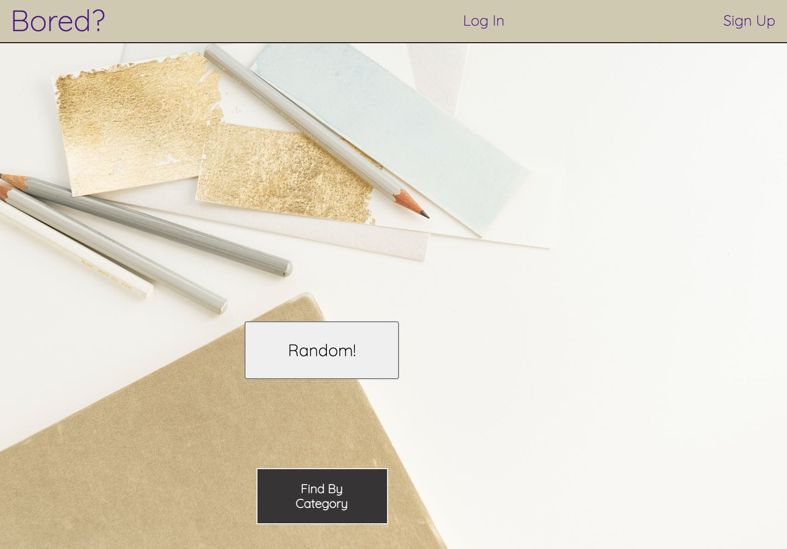

<h1 align="center">Bored?</h1>

---

<h4 style="font-weight: bold;" align="center">UMN Boot Camp Group Project # 3</h4>

## Table of Contents

- [About](#about)
- [Usage](#usage)
- [Built With](#built_using)
- [Authors](#authors)
- [Questions](#questions)
- [Screenshots](#screenshots)

## 

This application helps you figure out something to do when you are bored and can't think of a fun activity. It also has a social media element, as when you comment or rate an activity, it posts that activity to your profile page. When others make comments on that same activity, it will show on your profile too and so you can keep the conversation going!

## 

1. Navigate to the Heroku hosted <!-- [Bored?](https://cleadi-book-search-engine.herokuapp.com/) application. -->
2. Search for an activity by clicking the random button on the home page.
3. To make a comment or rate an activity you must sign in first.

## 

- React.js
- Express.js
- MongoDB

## 

- Laura Hofer
- Karna Sjoberg
- Sophia K
- Dillon Cleaver

## 

#### Please reach out via our GitHub profiles if you have any questions about the project!
- Laura - https://github.com/ljhofer
- Karna - https://github.com/kesjoberg
- Sophia - https://github.com/soph-k
- Dillon - https://github.com/cleadi

## 

